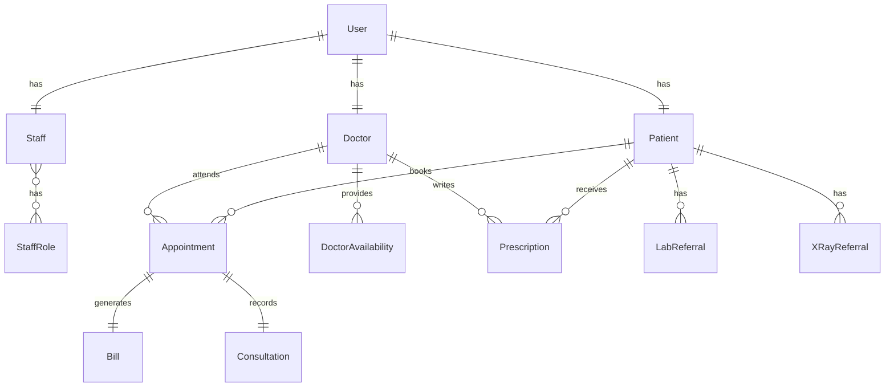

# Clinio – CareWell Hospital Management System

Clinio is a full-stack Django hospital management system built to manage hospital operations across patients, doctors, reception staff, and administrators. The project includes role-based dashboards, patient registration, appointment booking, doctor availability management, billing, dummy payment flow, email notifications, and PDF document generation.

This project was developed as a practical healthcare web application to demonstrate Django-based backend development, relational database modelling, role-based access control, workflow automation, and user-facing dashboard design.

## Project Highlights

- Multi-role hospital system for Admin, Doctor, Staff, and Patient users
- Patient self-registration with email/password and Google OAuth support
- OTP-based password reset using Celery email tasks
- Admin-created doctor and staff accounts with temporary password emails
- First-login password reset flow for doctor and staff users
- Doctor availability management with dynamic appointment slot selection
- Online appointment booking by patients with admin approval workflow
- Offline appointment booking by staff with delayed auto-approval
- Appointment status management: Pending, Approved, and Cancelled
- Billing dashboard for approved appointments
- Dummy online payment simulation using Card/UPI inputs
- Automatic invoice number generation and PDF invoice download/email
- Doctor consultation workflow with symptoms, diagnosis, prescription, lab referral, and x-ray referral
- PDF generation for prescriptions, lab referrals, x-ray referrals, and invoices
- Patient record viewing for doctors and staff
- Admin dashboard with appointment statistics, charts, filters, and pagination
- Public hospital website pages for departments, doctors, contact, and emergency information

## Tech Stack

| Area | Technology |
|---|---|
| Backend | Python, Django 5.2 |
| Database | SQLite for local development, MySQL support for deployment |
| Frontend | HTML, Tailwind CSS, JavaScript |
| Authentication | Django Auth, Django Allauth, Google OAuth |
| Background Tasks | Celery |
| Message Broker | RabbitMQ / AMQP |
| Email | SMTP email integration |
| PDF Generation | ReportLab, xhtml2pdf |
| Media Handling | Django media files for doctor profiles, reports, and x-ray uploads |
| Dashboard Visualisation | Chart.js |

## Project Structure

```text
clinio/
├── accounts/          # Billing, payment simulation, invoice generation, collection reports
├── admins/            # Admin dashboard, doctor/staff/patient/appointment management
├── appointments/      # Appointment booking, slot handling, approval, cancellation, consultation model
├── clinio/            # Main Django project settings, URLs, WSGI/ASGI, Celery setup
├── doctors/           # Doctor dashboard, availability, consultation, prescriptions, referrals
├── home/              # Public hospital website pages and speciality pages
├── patients/          # Patient registration, login, Google OAuth handling, profile, OTP reset
├── staff/             # Reception staff dashboard, offline patient registration, report uploads
├── manage.py
└── requirements.txt
```

## App-Level Breakdown

### `home`

The `home` app manages the public-facing hospital website. It includes the landing page, about page, speciality pages, doctor listing page, contact page, and emergency contact page. This gives the project a complete hospital website interface instead of only internal dashboards.

Main pages include:

- Home
- About
- Cardiology
- General Medicine
- Neurology
- Orthopaedics
- Pediatrics
- Dermatology
- Our Doctors
- Contact Us
- Emergency Contact

### `patients`

The `patients` app manages patient-side user flows. Patients can register online, log in, complete their profile, reset passwords through OTP, view their dashboard, edit profile details, and manage their own appointments.

Key responsibilities:

- Online patient registration
- Login and logout
- OTP-based forgot password flow
- Patient profile completion after login
- Patient dashboard
- Patient profile edit
- Google OAuth patient profile creation
- Online patient account and profile management

Main model:

```python
Patient
```

Important fields include phone, address, date of birth, gender, city, state, zip code, registration source, and profile completion status.

### `doctors`

The `doctors` app manages doctor-side workflows. Doctors can log in, reset their temporary password, view approved appointments, manage availability, view patient records, start consultations, and generate medical documents.

Key responsibilities:

- Doctor login and logout
- Doctor password reset on first login
- Doctor dashboard
- Availability creation and validation
- Upcoming approved appointment view
- Patient record access
- Consultation form
- Prescription generation
- Lab referral generation
- X-ray referral generation
- PDF download views

Main models:

```python
Doctor
DoctorAvailability
Prescription
LabReferral
XRayReferral
```

The `DoctorAvailability` model prevents overlapping availability slots and ensures the start time is before the end time.

### `staff`

The `staff` app supports receptionist or hospital staff workflows. Staff can log in, reset temporary passwords, register offline patients, book offline appointments, view patients, and upload lab or x-ray reports.

Key responsibilities:

- Staff login and logout
- Staff first-login password reset
- Staff dashboard
- Offline patient registration
- Offline appointment support
- Patient list view
- Lab report upload
- X-ray report upload

Main models:

```python
Staff
StaffRole
```

The staff role model supports assigning one or more roles to staff users.

### `admins`

The `admins` app manages the custom admin dashboard and hospital administration workflows. It is separate from Django's default admin panel and gives a user-friendly dashboard for hospital operations.

Key responsibilities:

- Custom admin login
- Admin dashboard with summary cards
- Appointment filters and pagination
- Doctor management: add, view, edit, delete
- Staff management: add, view, edit, delete
- Patient management: view, edit, delete
- Appointment management: approve, cancel, edit, delete
- Doctor availability reports
- Offline patient registration from admin side
- Amount collection reports

Dashboard features include:

- Total patients
- Total doctors
- Total staff
- Total appointments
- Pending appointments
- Today's appointments
- Appointment charts
- Doctor-wise appointment statistics

### `appointments`

The `appointments` app contains the main appointment workflow. It connects patients, doctors, staff, and admins through online and offline appointment booking flows.

Key responsibilities:

- Appointment model
- Online patient appointment booking
- Staff/offline appointment booking
- Admin approval and cancellation
- Dynamic available date and time slot APIs
- Patient appointment edit/delete before approval
- Staff appointment view/edit/delete
- Auto-approval task for offline appointments
- Appointment confirmation email task
- Consultation model

Main models:

```python
Appointment
Consultation
```

The appointment model stores patient, doctor, date, time, status, source, payment status, payment method, amount, transaction ID, and invoice number.

The system calculates appointment fees based on doctor specialization. For example, cardiology and neurology appointments can have different consultation fees from general appointments.

### `accounts`

The `accounts` app handles billing and payment-related workflows.

Key responsibilities:

- Billing dashboard
- Marking offline payments as paid
- Dummy Card/UPI payment simulation
- Invoice number generation
- PDF invoice generation
- Payment confirmation email with invoice attachment
- Amount collected report with date filtering

Main model:

```python
Bill
```

## Main User Roles

### Admin

The admin manages the hospital system from a custom dashboard. Admin users can create doctors and staff, manage appointments, view reports, edit patient records, approve appointments, and monitor hospital activity.

### Patient

Patients can register online, complete their profile, book appointments, view appointment status, modify or cancel pending appointments, and make dummy online payments after appointment approval.

### Doctor

Doctors can view their approved appointments, access patient details, add availability, start consultations, record diagnosis and prescription details, and generate prescription/referral PDFs.

### Staff / Receptionist

Staff users can register walk-in patients, book offline appointments, view patient records, upload lab/x-ray reports, and support billing workflows.

## Core Workflow

```text
Patient registers or staff registers patient offline
            ↓
Patient/staff books appointment
            ↓
System checks doctor availability and free time slots
            ↓
Online appointments wait for admin approval
Offline appointments are auto-approved after a delay
            ↓
Approved appointment becomes available for billing/payment
            ↓
Patient or staff completes payment flow
            ↓
System generates invoice and sends email confirmation
            ↓
Doctor conducts consultation and generates medical documents
```

## Database Design Overview



## Important Features in Detail

### 1. Role-Based Dashboards

The system separates access and interface design for patients, doctors, staff, and admins. Each role has its own dashboard and workflow, which makes the project closer to a real hospital management system.

### 2. Dynamic Appointment Slot Handling

Doctors can define availability by date and time range. The system generates 30-minute appointment slots and removes already-booked slots from the available list. This prevents double booking and gives patients/staff only valid appointment times.

### 3. Online and Offline Appointment Flow

The project supports both online and offline hospital workflows:

- Online appointments are booked by patients and require admin approval.
- Offline appointments are booked by staff for walk-in patients and are auto-approved after a short delay using Celery.

### 4. Billing and Payment Simulation

Only approved appointments are made available for payment. The project includes a dummy Card/UPI payment page for patient-side online payment simulation. Staff can also mark offline payments as paid from the billing dashboard.

### 5. Email and PDF Automation

The system sends confirmation emails for appointment approval and payment completion. It also generates PDF invoices and medical documents such as prescriptions, lab referrals, and x-ray referrals.

### 6. Doctor Consultation Module

Doctors can start a consultation from an approved appointment, enter symptoms, diagnosis, prescription details, lab referral notes, and x-ray referral notes. After saving, the system provides document download options.

### 7. Admin Analytics Dashboard

The custom admin dashboard includes summary metrics, appointment listings, filters, pagination, and chart-based visualisation. This helps demonstrate dashboard development and backend data aggregation.

## Local Setup

### 1. Clone the repository

```bash
git clone <your-repository-url>
cd clinio
```

### 2. Create and activate a virtual environment

```bash
python -m venv env
```

For Windows:

```bash
env\Scripts\activate
```

For macOS/Linux:

```bash
source env/bin/activate
```

### 3. Install dependencies

```bash
pip install -r requirements.txt
```

Note: If the requirements file opens with unusual characters, convert it to UTF-8 before installing:

```bash
python -c "from pathlib import Path; p=Path('requirements.txt'); p.write_text(p.read_text(encoding='utf-16'), encoding='utf-8')"
```

### 4. Create a `.env` file

Create a `.env` file in the same folder as `manage.py`.

Example:

```env
SECRET_KEY=your-django-secret-key
DEBUG=True
ALLOWED_HOSTS=127.0.0.1,localhost
EMAIL_HOST_USER=your-email@example.com
EMAIL_HOST_PASSWORD=your-email-app-password
CELERY_BROKER_URL=your-celery-broker-url
USE_PAMYSQL=False
```

### 5. Apply migrations

```bash
python manage.py migrate
```

### 6. Create a superuser

```bash
python manage.py createsuperuser
```

### 7. Run the development server

```bash
python manage.py runserver
```

Then open:

```text
http://127.0.0.1:8000/
```

## Optional: Run Celery Worker

Celery is used for background tasks such as OTP emails, appointment confirmation emails, and offline appointment auto-approval.

```bash
celery -A clinio worker -l info
```

A valid broker such as RabbitMQ, Redis, or a hosted AMQP service is required.

## Main URLs

| Module | URL |
|---|---|
| Home | `/` |
| Patient Login | `/patients/login/` |
| Patient Registration | `/patients/register/` |
| Patient Dashboard | `/patients/dashboard/` |
| Admin Login | `/admins/admins_login/` |
| Admin Dashboard | `/admins/admins_dashboard/` |
| Doctor Login | `/doctors/doctor_login/` |
| Doctor Dashboard | `/doctors/dashboard/` |
| Staff Login | `/staff/staff_login/` |
| Staff Dashboard | `/staff/dashboard/` |
| Patient Appointment Booking | `/appointments/patients/book/` |
| Staff Appointment Booking | `/appointments/staff/book/` |
| Patient Appointments | `/appointments/my-appointments/` |
| Billing Dashboard | `/account/billing/` |

## Security Note Before Publishing

Before pushing this project to a public GitHub repository, move all sensitive values out of `settings.py` and into environment variables. This includes:

- Django secret key
- Email username and password
- Celery broker URL
- Database username and password
- OAuth credentials

Also remove local/generated files such as:

- `db.sqlite3`
- `dump.rdb`
- uploaded `media/` files
- `staticfiles/`
- virtual environment folders

The project already includes a `.gitignore`, but it is recommended to double-check the repository before publishing.

## Suggested Improvements

Future improvements can include:

- Stronger role-based permission checks using Django groups or custom decorators
- REST API layer using Django REST Framework
- Real payment gateway integration
- Appointment rescheduling with notification support
- Unit tests for appointment, billing, and authentication workflows
- Docker setup for easier deployment
- Better environment-based production settings
- Audit logs for medical and payment-related actions
- Improved UI consistency across dashboards

## What This Project Demonstrates

This project demonstrates practical experience in:

- Django full-stack development
- Relational database design
- Authentication and user role separation
- CRUD operations across multiple linked models
- Appointment scheduling logic
- Background task processing with Celery
- Email automation
- PDF generation
- Dashboard development
- Healthcare workflow modelling
- Clean project organisation using multiple Django apps

## Author

**Nimijith Nimmi Jayan**  
MSc Artificial Intelligence Student  
Heriot-Watt University, Scotland, UK

